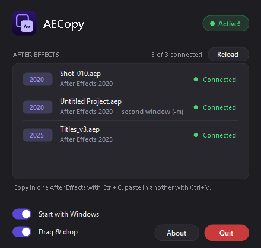

<h1 align="center">AECopy</h1>

<b>Ctrl+C in one After Effects, Ctrl+V in another. Or just drag and drop.</b> 
Layers, effects, keyframes and whole compositions, between two windows or two versions (2020 to 2026). 
Windows · v1.0.0 · by <a href="https://ilhanturan.fr">Ilhan Turan</a>

> Made with the help of AI. Tested a lot, but not 100% reliable: keep a backup of important projects and please report anything that does not paste right ([Issues](../../issues)).

## Install

1. Download the [latest version](../../releases/latest) and unzip it **in a folder where it will stay** (e.g. `C:\Tools\AECopy`, not Downloads or a temp folder): AECopy creates a `mailbox` folder with its log files next to the exe, and its After Effects and Windows startup entries point to that place. Keep `AECopy.exe` and `AECopy.jsx` together.
2. In **every** After Effects you use: *Edit > Preferences > Scripting & Expressions >* tick **Allow Scripts to Write Files and Access Network**.
3. Run `AECopy.exe`. It installs its startup script in each After Effects version found and starts with Windows (can be turned off).
4. AECopy connects to the After Effects already open. If one shows *Not connected*, click **Reload**.

## Use

- Select layers, effects/keyframes, or a composition in the Project panel, press **Ctrl+C**.
- Click in the other After Effects, press **Ctrl+V**.
- Same After Effects: normal Ctrl+C / Ctrl+V, AECopy stays out of the way.
- **Drag & drop:** drag your selection from one After Effects and drop it on the other one, across screens too. A label near the cursor shows where it will land.

| You copied or dragged | It pastes |
|---|---|
| Layers | in the open comp, above the selected layer (a comp is created if none is open) |
| Effects, properties, keyframes | on the selected layers, keys starting at the current time |
| A composition (Ctrl+V) | in the project, with its precomps, footage and solids |
| A composition (drag & drop) | in the project **and** as a layer in the open comp |

## What works

- Solids, adjustment layers, nulls, text (point, paragraph, vertical, on a path), shapes (all operators), precomps, footage, image sequences, audio, placeholders, cameras, lights, 3D model layers.
- Effects (all parameters, layer references renumbered), masks, keyframes (ease, hold, spatial, roving, labels), expressions, markers, parenting, track mattes, time remap, time stretch, blending modes, switches.
- Composition settings (size, frame rate, duration, background, work area, motion blur, 3D renderer…).
- Text styles: font, size, colors, stroke, tracking, leading… and **several styles in one text** when pasting into After Effects 2024.3 or later (also when copied from 2020).
- Missing footage becomes a placeholder; footage already in the target project is reused.
- After each paste, AECopy compares the result with the original and reports any difference.

## What does not work

- Internal effect data scripts cannot read: Curves, Hue/Saturation channel range, shape gradient colors, Mocha tracks, tracker data.
- Layer styles, Essential Properties.
- Several styles in one text when pasting **into** After Effects older than 2024.3 (the first style is kept, you get a warning).
- Faux bold, all caps, small caps, superscript/subscript on text in After Effects 2020 (read-only for scripts there).
- An environment light pasted in a comp whose 3D renderer does not support it becomes an ambient light (you get a warning).

## Good to know

- **Not connected?** Click **Reload** (or right-click the tray icon > Reload). After Effects stops AECopy whenever a window opens in it (Mocha, an alert, a dialog): close it, then Reload. AECopy only connects when it starts, when an After Effects starts, and on Reload.
- **Quit** stops AECopy everywhere; it comes back with Windows or when you run it again.
- **Drag & drop** pastes into the open comp of the target After Effects, not at the exact drop point (scripts cannot know what is under the mouse). Turn it off with the **Drag & drop** switch if dragging a panel from one After Effects onto the other ever triggers it.
- After Effects 2020 does not tell scripts which comp is open: select the target comp in its Project panel if a drop lands in the wrong one.
- Log: tray icon > *Open log*, or the `mailbox` folder next to the exe. Tray icon > *Clear cache* deletes the logs and temporary files, as if AECopy were new (settings are kept).
- Command line: `AECopy.exe --reload`, `AECopy.exe --quit`.

## Build from source

`build.ps1` compiles `AECopy.cs` with the C# compiler that ships with Windows (.NET Framework 4) and generates the icon. `AECopy.jsx` is the After Effects side (ExtendScript).

---

## En français

**AECopy** : Ctrl+C dans un After Effects, Ctrl+V dans un autre (calques, effets, clés, compositions entières), entre deux fenêtres ou deux versions de 2020 à 2026.

> Fait avec l'aide de l'IA. Beaucoup testé mais pas fiable à 100 % : gardez une sauvegarde de vos projets importants et signalez ce qui ne se colle pas bien ([Issues](../../issues)).

- **Installer** : dézipper la Release dans un dossier où elle restera (ex. `C:\Tools\AECopy`, pas Téléchargements) car AECopy crée à côté de l'exe un dossier `mailbox` avec ses fichiers de log, et ses lancements automatiques pointent vers cet endroit ; cocher *Allow Scripts to Write Files and Access Network* dans les préférences de chaque After Effects, lancer `AECopy.exe`, il se connecte aux After Effects déjà ouverts.
- **Utiliser** : sélectionner, Ctrl+C dans un After Effects, Ctrl+V dans l'autre. Dans le même After Effects, rien ne change.
- **Glisser-déposer** : glisser la sélection d'un After Effects et la lâcher sur l'autre, même d'un écran à l'autre. Une comp glissée est aussi posée en calque dans la comp ouverte.
- **Ne passe pas** : données internes de certains effets (Courbes, Mocha…), styles de calque, Essential Properties, plusieurs styles dans un texte collé vers un After Effects antérieur à 2024.3.
- **Pas connecté ?** Bouton **Reload**. After Effects coupe AECopy dès qu'une fenêtre s'ouvre (Mocha, alerte, boîte de dialogue) : la fermer, puis Reload.

MIT License · [ilhanturan.fr](https://ilhanturan.fr)
